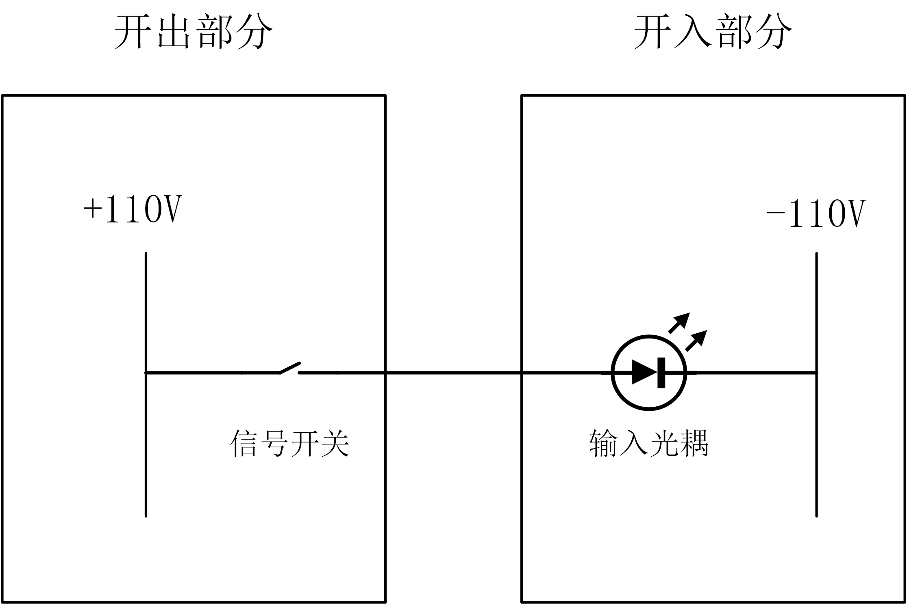

### 智能变电站的演化过程

-------------------------

#### 目录

[TOC]

#### 1.1 变电站二次设备的发展过程

任何事物的发展都是阶梯型渐进式的，智能变电站也不例外。变电站二次设备的发展历史主要是继电保护设备的发展历史，继电保护装置在历史上大致分为*继电器保护* $ \rightarrow$ *微机保护* $\rightarrow$ *数字化微机保护* 三个阶段。

需要指出的是，从严格的发展来讲，这里给出的发展路线是不严格的，比如在继电器保护的发展又可以划分为电磁型继电器、感应型继电器、晶体管型继电器三个阶段，而在微机保护出现之前也出现过集成电路型的继电保护装置。数字化微机保护虽然与传统微机保护采用了完全不同的硬件结构，但是其本质上还是属于微机保护，而微机保护的最新发展是采用高防护等级的就地化保护装置。

这里之所以采用这种发展路线，主要是为了契合本文的主题。继电器保护是继电保护发展历史上发展时间最长的一个阶段，其历史地位是毋庸置疑的。而本文主要介绍的采用61850标准的数字化微机保护，其基本原理主要继承于传统的微机保护，所以在这里将其分成两个部分，着重介绍传统微机保护装置发展演化成为数字化微机保护装置的原理及原因。

#### 1.2 传统常规微机保护的基本原理及其缺点

在现阶段的工业自动化领域，人类所发明的自动化设备本质上都是一个输入输出系统[注1]。继电保护装置也不例外。常规微机保护装置的输入量有两种，第一种是交流模拟输入量，主要是输入完成保护逻辑所需要的电流和电压量；第二种是数字开入量，主要输入各种功能硬压板、保护之间的配合信号以及用于监视设备运行状态的硬结点信号。而其输出量也有两种，一种是发出跳闸、合闸命令，或者反应装置运行状态的数字开出量，另一种是通过串口或网口等多种通讯方式与监控后台等的通信量。

常规微机保护装置的这四种输入输出量都存在一定的缺点，下面一一进行讨论。

##### 1.2.1 交流模拟输入量的缺点

交流模拟量的主要问题在于常规互感器二次线圈的数量较少与需要同一组模拟量的保护装置较多之间的矛盾。以一条线路间隔的A相电流量为例，一个线路间隔至多配备一组A相CT，而需要这一组电流量的装置却有AB套线路保护，母线保护，故障录波装置等等。这就意味着需要从CT二次线圈的一端串接所有需要这组A相保护电流的二次设备然后回到CT二次线圈的另一端。同时，CT的二次线圈在运行情况下是绝对不允许开路的，中间这么多接线环节不仅导致二次接线复杂，而且会带来安全风险。

##### 1.2.2 数字开入开出量的缺点

一个完整的信号回路如下图所示，整体上整个回路可以分割为开入和开出两部分。

输出节点可能是反应设备运行状态的继电器的常开或常闭节点，如反应开关GIS气室压力的压力继电器的常开结点；也可能是保护装置的功能压板，如检修压板，保护硬压板等。而输入部分均是保护装置开入插件的光耦的强电输入部分。当信号开关闭合时，回路导通，使光耦导通动作，开入部分便可以感知到该信号。这就意味着一个完整的信号至少两根电缆进行传输[注2]。

数字开出量也是同样的道理，在变电站信号量特别多的情况下，会导致使用大量的二次电缆，施工难度及周期较长。

##### 1.2.3 通信输出量的缺点

在传统常规站中，通信输出量的主要问题并不受限于硬件的限制或者技术条件的限制，而是受限于缺乏统一的规约。在61850之前，也出现过很多常用的用于自动化系统的规约，包括工业控制领域常见的modbus，DNP3以及电力领域专用的IEC60870，CDT等。但是，由于规约本身的固有缺陷，导致其在功能上无法满足工程需要，而且在很多细节上没有给出严格的规定，这就导致了不同厂家需要在规约的基础上进行扩展。其中最为典型的例子便是IEC60870-103，基本上所有的厂家都在其基础上做了扩展，导致各个厂家之间的设备基本无法进行通讯。

#### 1.3 数字化继电保护装置解决上述问题的方法

这里所指的数字化继电保护装置指的便是完全采用IEC61850规约的装置。在解决交流模拟量复用以及数字信号量传输的问题上，61850均使用了较为成熟的工业以太网技术。

合并单元将交流模拟量进行采样之后，通过SV网络报文的方式广播至过程层网络，任何连接至过程层网络的二次设备均可通过订阅SV报文的方式获取这一组交流模拟量的采样信息。而开关量则是将二次设备本身所有的开关输出状态通过数据集的方式打包至同一帧GOOSE报文中，然后将GOOSE报文广播至过程层网络，所有需要其中的开关量信息的二次设备均可以通过订阅GOOSE报文方式获取其中的信息。

而解决输出的通信量的不一致以及无法互操作的问题，则是通过统一通讯规约的方式进行实现的。各个厂家均采用MMS作为站控层的通信规约，大大提高了二次设备的互操作性。

#### 注释

[注1] 这也是人类同机械的本质区别，但凡给定一定输出只能得出一定输出的系统均属于自动化的范畴，而并非智能。所以将数字化变电站称之为智能变电站这一说法从理论上来讲是欠妥的，只是自动化的水平提高了而已，远达不到所谓智能的程度。

[注2]这里所说一个信号需要两根电缆进行传输是从信号回路完整性的角度出发的，实际上同一个屏柜中多个硬节点通常公用一个正公共端，所以传输统一屏柜的$n$个信号通常只需要$(n+1）$根电缆。